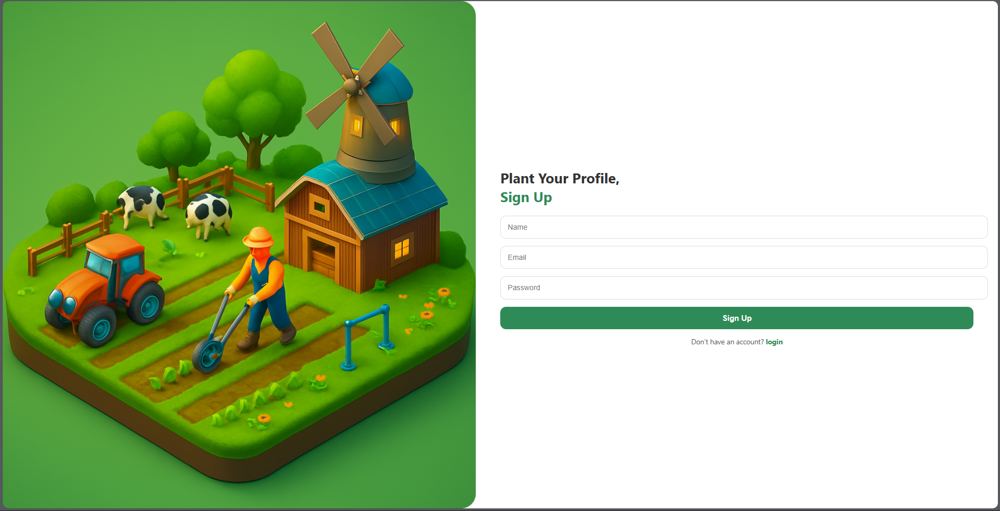
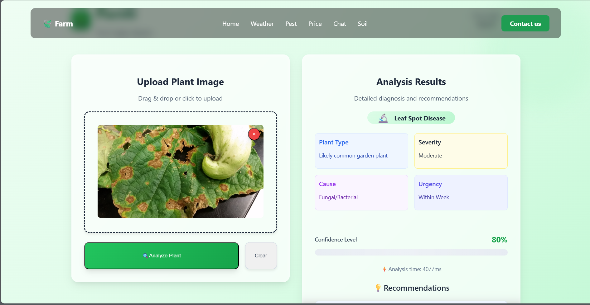
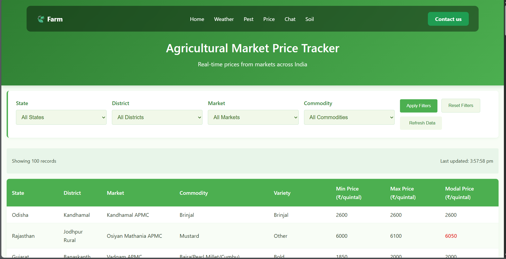

# 🌾 Farming Advisory
### AI-Powered Smart Agriculture Assistant

<p align="center">
  
  
  
  
  
</p>

<p align="center">
  <b>An AI-powered agriculture platform designed to help farmers access intelligent crop, weather, disease, and market information through a unified application.</b>
</p>

---

## 📚 Research Publication

> 🏆 **This project has been published in a Springer conference.**

| Publication Detail | Information |
|---|---|
| **Title** | Farming Advisory – AI-Based Smart Agriculture Assistant |
| **Publisher** | Springer |
| **Conference** | `[Add Conference Name]` |
| **Publication Year** | `[Add Year]` |
| **DOI** | `[Add DOI]` |
| **Published Paper** | `[Add Springer Link]` |

### Research Contribution

The research presents an AI-assisted smart agriculture platform that brings together plant disease detection, weather information, agricultural assistance, and market-related insights to support informed farming decisions.

---

# 📌 Table of Contents

- [Overview](#-overview)
- [Problem Statement](#-problem-statement)
- [Objectives](#-objectives)
- [Key Features](#-key-features)
- [System Architecture](#-system-architecture)
- [AI/ML Pipeline](#-aiml-pipeline)
- [Technology Stack](#-technology-stack)
- [Project Structure](#-project-structure)
- [Getting Started](#-getting-started)
- [Environment Configuration](#-environment-configuration)
- [Running the Application](#-running-the-application)
- [API Documentation](#-api-documentation)
- [Application Screenshots](#-application-screenshots)
- [Security](#-security)
- [Project Impact](#-project-impact)
- [Future Scope](#-future-scope)
- [Publication](#-publication)
- [Contributing](#-contributing)
- [License](#-license)
- [Developer](#-developer)

---

# 🌱 Overview

**Farming Advisory** is a full-stack, AI-powered smart agriculture application designed to make agricultural information more accessible through a single digital platform.

The application combines multiple agriculture-focused services, including:

- 🌱 Plant disease detection
- 🌦️ Weather information
- 🤖 AI-powered agricultural assistance
- 💹 Agricultural market information
- 🔐 User-oriented functionality
- 📱 Farmer-friendly interface

The project focuses on using modern software, AI, and machine-learning technologies to support farmers in making more informed agricultural decisions.

---

# ❗ Problem Statement

Farmers often need information from multiple sources to make decisions related to crop health, weather, agricultural practices, and market conditions.

Common challenges include:

- Difficulty identifying plant diseases at an early stage
- Limited access to convenient agricultural guidance
- Dependence on multiple information sources
- Difficulty interpreting weather information for farming activities
- Limited visibility into agricultural market conditions

### 💡 Proposed Solution

Farming Advisory provides a unified platform where users can access multiple agriculture-related services through a single application.

```text
                         FARMER
                            │
                            ▼
                 ┌────────────────────┐
                 │ Farming Advisory   │
                 │     Platform       │
                 └─────────┬──────────┘
                           │
          ┌────────────────┼────────────────┐
          │                │                │
          ▼                ▼                ▼
      🌱 Disease       🌦️ Weather       💹 Market
      Detection        Information       Insights
          │                │                │
          └────────────────┼────────────────┘
                           │
                           ▼
                    🤖 AI Assistant
                           │
                           ▼
                  Agricultural Insights
```

---

# 🎯 Objectives

The primary objectives of Farming Advisory are:

1. Develop an intelligent agriculture assistance platform.
2. Provide image-based plant disease detection.
3. Integrate weather information for agricultural planning.
4. Provide AI-based assistance for agriculture-related queries.
5. Present useful agricultural market information.
6. Provide a simple and accessible user interface.
7. Integrate multiple agricultural services into a unified application.

---

# ✨ Key Features

## 🌱 1. AI-Based Plant Disease Detection

The plant disease detection module analyzes uploaded plant or leaf images using an AI/ML pipeline.

### Workflow

```text
Plant / Leaf Image
        ↓
    Image Upload
        ↓
 Image Validation
        ↓
Image Preprocessing
        ↓
    AI / ML Model
        ↓
Disease Classification
        ↓
 Prediction Result
        ↓
Treatment / Prevention Guidance
```

### Capabilities

- 📷 Plant image upload
- 🧠 AI/ML-based image analysis
- 🌱 Disease classification
- 📊 Prediction results
- 💡 Treatment and prevention guidance

---

## 🌦️ 2. Weather Intelligence

The weather module provides weather-related information that can support agricultural planning.

### Information

- 🌡️ Temperature
- 💧 Humidity
- 🌧️ Rainfall information
- ☁️ Current weather conditions
- 📅 Forecast information

### Agricultural Applications

Weather information can assist farmers with decisions related to:

- Irrigation
- Spraying
- Fertilizer application
- Crop protection
- Field activities

---

## 🤖 3. AI-Powered Farming Assistant

The AI assistant allows users to ask agriculture-related questions using natural language.

### Example Queries

```text
"What fertilizer is suitable for tomato plants?"

"Why are my plant leaves turning yellow?"

"How often should I water my crop?"

"What are the common diseases affecting rice?"
```

### Capabilities

- 💬 Natural-language interaction
- 🤖 AI-generated responses
- 🌱 Agricultural guidance
- 🔍 Query-based assistance
- 🎙️ Voice interaction support

---

## 💹 4. Agricultural Market Information

The market module provides agricultural price and market-related information.

### Capabilities

- 💰 Crop price information
- 📊 Market comparison
- 🏪 Market-related insights
- 📈 Price awareness
- 🌾 Crop-specific information

The objective is to help farmers understand available market information and make more informed selling decisions.

---

## 🔐 5. User Management & Secure Configuration

The application supports user-oriented functionality and protected services.

Sensitive configuration is maintained outside the source code using environment variables.

Examples include:

```text
API Keys
Authentication Credentials
Database Credentials
AI Service Credentials
Communication Service Credentials
```

---

## 📱 6. Farmer-Friendly Interface

The application is designed with simplicity and accessibility in mind.

### Design Principles

- Clean navigation
- Simple workflows
- Clear information presentation
- Responsive interface
- Easy access to major modules

---

# 🏗️ System Architecture

```text
┌──────────────────────────────────────────────────────┐
│                       FARMER                         │
└──────────────────────────┬───────────────────────────┘
                           │
                           ▼
┌──────────────────────────────────────────────────────┐
│                  REACT FRONTEND                      │
│                                                      │
│ Dashboard │ Disease │ Weather │ Market │ AI Assistant│
└──────────────────────────┬───────────────────────────┘
                           │
                       REST APIs
                           │
                           ▼
┌──────────────────────────────────────────────────────┐
│                       BACKEND                        │
│                                                      │
│             FastAPI / Node.js / Express              │
└───────────────┬──────────────┬──────────────┬────────┘
                │              │              │
                ▼              ▼              ▼
        ┌────────────┐ ┌────────────┐ ┌──────────────┐
        │  AI / ML   │ │ Weather API│ │ Market Data  │
        │   Engine   │ │            │ │              │
        └─────┬──────┘ └────────────┘ └──────────────┘
              │
              ▼
        ┌────────────┐
        │  Disease   │
        │ Prediction │
        └─────┬──────┘
              │
              ▼
      ┌───────────────────┐
      │ Agricultural      │
      │ Recommendations   │
      └───────────────────┘
```

---

# 🧠 AI/ML Pipeline

The plant disease detection workflow follows a structured image-analysis process.

```text
Input Image
     │
     ▼
Image Validation
     │
     ▼
Image Preprocessing
     │
     ▼
AI / ML Model
     │
     ▼
Feature Analysis
     │
     ▼
Disease Prediction
     │
     ▼
Prediction Result
     │
     ▼
Agricultural Guidance
```

The AI component can be further improved through larger datasets, transfer learning, model optimization, and additional crop/disease classes.

---

# 🛠️ Technology Stack

## Frontend

| Technology | Purpose |
|---|---|
| React.js | User interface |
| JavaScript | Application logic |
| HTML5 | Page structure |
| CSS3 | Styling |
| Vite | Development and build tooling |

## Backend

| Technology | Purpose |
|---|---|
| Python | AI/ML and backend development |
| FastAPI | REST API development |
| Node.js | Backend services |
| Express.js | Server-side functionality |

## AI / Machine Learning

| Technology | Purpose |
|---|---|
| Python | AI/ML development |
| Image Processing | Plant image analysis |
| Machine Learning | Prediction |
| Deep Learning | Image classification |
| NLP / Generative AI | Agricultural assistant |

## Database & Services

| Technology | Purpose |
|---|---|
| MongoDB | Data storage |
| Weather API | Weather information |
| Market API | Agricultural market information |
| Gemini / AI API | AI-powered assistance |
| Twilio | Communication / voice services |

## Development Tools

- Git
- GitHub
- Visual Studio Code
- Postman
- npm
- Python Virtual Environment

---

# 📂 Project Structure

```text
Farming_advisory-main/
│
├── backend/
│   ├── app.py
│   ├── server.js
│   ├── requirements.txt
│   └── ...
│
├── public/
│
├── src/
│   ├── assets/
│   │   ├── signup.png
│   │   ├── home.png
│   │   ├── weather.png
│   │   ├── pest.png
│   │   └── price.png
│   │
│   ├── components/
│   ├── pages/
│   ├── App.jsx
│   └── ...
│
├── .gitignore
├── package.json
├── package-lock.json
└── README.md
```

---

# ⚙️ Getting Started

## Prerequisites

Install the following before running the project:

- Node.js
- npm
- Python 3.x
- Git
- MongoDB
- Visual Studio Code

---

## 1. Clone the Repository

```bash
git clone https://github.com/Tanya-k20/Plant-disease-detection-system.git
cd Plant-disease-detection-system
```

---

## 2. Install Frontend Dependencies

```bash
npm install
```

---

## 3. Configure the Backend

Navigate to the backend:

```bash
cd backend
```

Create a Python virtual environment:

```bash
python -m venv .venv
```

### Windows

```powershell
.\.venv\Scripts\Activate.ps1
```

### Linux / macOS

```bash
source .venv/bin/activate
```

Install dependencies:

```bash
pip install -r requirements.txt
```

---

# 🔑 Environment Configuration

Create the following file locally:

```text
backend/.env
```

Use placeholder values such as:

```env
WEATHER_API_KEY=your_weather_api_key
GEMINI_API_KEY=your_gemini_api_key
GEMINI_MODEL=your_model_name

TWILIO_ACCOUNT_SID=your_twilio_account_sid
TWILIO_AUTH_TOKEN=your_twilio_auth_token

ALLOWED_ORIGINS=http://localhost:5173
MAX_IMAGE_MB=8
```

> ⚠️ **Never commit real API keys, passwords, tokens, or credentials to GitHub.**

Recommended `.gitignore` entries:

```gitignore
.env
.env.*
backend/.env
node_modules/
.venv/
venv/
__pycache__/
*.pyc
```

---

# ▶️ Running the Application

## Start Backend

From the `backend` directory:

```bash
uvicorn app:app --reload --port 8000
```

Backend:

```text
http://localhost:8000
```

---

## Start Frontend

Open a second terminal in the project root:

```bash
npm run dev
```

Frontend:

```text
http://localhost:5173
```

---

# 🧪 API Documentation

If FastAPI is enabled, interactive documentation is available at:

### Swagger UI

```text
http://localhost:8000/docs
```

### ReDoc

```text
http://localhost:8000/redoc
```

The APIs can also be tested using **Postman**.

---

# 🖼️ Application Screenshots

## 🔐 Signup Page



---

## 🏠 Home Dashboard


---

## 🌦️ Weather Module


---

## 🌱 Plant Disease Detection



---

## 💹 Market Price Module



---

# 🔄 End-to-End Workflow

```text
                         FARMER
                           │
                           ▼
                ┌────────────────────┐
                │ Farming Advisory   │
                │    Frontend        │
                └─────────┬──────────┘
                          │
                          ▼
                ┌────────────────────┐
                │    Backend APIs    │
                └─────────┬──────────┘
                          │
          ┌───────────────┼───────────────┐
          │               │               │
          ▼               ▼               ▼
      🌱 Disease       🌦️ Weather      💹 Market
      Detection        Information      Data
          │               │               │
          └───────────────┼───────────────┘
                          │
                          ▼
                   🤖 AI Assistant
                          │
                          ▼
               Agricultural Insights
                          │
                          ▼
                        FARMER
```

---

# 📊 Project Impact

Farming Advisory aims to reduce the information gap between farmers and modern agricultural technology.

### 🌱 Crop Health

AI-based image analysis can assist in identifying potential plant diseases.

### 🌦️ Agricultural Planning

Weather information can support decisions related to irrigation and field activities.

### 💹 Market Awareness

Market information can provide farmers with greater visibility into crop prices.

### 🤖 AI Assistance

The conversational assistant provides an accessible interface for agriculture-related questions.

### 📱 Unified Platform

Multiple agriculture-focused services are brought together into one application.

---

# 🔒 Security

The project follows basic secure-development practices.

### Security Measures

- Environment-based secret management
- `.env` exclusion from version control
- API credential protection
- Input validation
- Controlled CORS configuration
- Image upload size restrictions
- Separation of frontend and backend services

### Never Commit

```text
❌ API Keys
❌ Passwords
❌ Database Credentials
❌ Authentication Tokens
❌ Twilio Credentials
❌ AI Service Credentials
❌ Private Configuration
```

---

# 🚀 Future Scope

The platform can be extended with advanced smart-agriculture capabilities.

### Potential Enhancements

- 🌐 Indian regional language support
- 🎙️ Advanced voice-based agricultural assistant
- 📱 Native Android/iOS applications
- 📍 GPS-based farm recommendations
- 🛰️ Satellite-based crop monitoring
- 📊 Crop health analytics
- 🔔 Personalized farming alerts
- 🌧️ Weather-driven crop recommendations
- 📈 Agricultural price forecasting
- 🧠 Improved disease classification models
- 📷 Real-time camera-based disease detection
- ☁️ Cloud deployment and scalable infrastructure
- 📡 IoT-based soil and environmental monitoring

---

# 🏆 Project Highlights

| Area | Highlight |
|---|---|
| 🌱 Agriculture | AI-assisted smart farming |
| 🤖 Artificial Intelligence | AI-powered agricultural assistant |
| 🧠 Machine Learning | Plant disease detection |
| 🌦️ Weather | Weather information integration |
| 💹 Market | Agricultural market insights |
| 💻 Full Stack | React + Backend APIs |
| 🔐 Security | Environment-based configuration |
| 📚 Research | Springer conference publication |

---

# 📚 Publication

## Springer Conference

This project was developed as a research-oriented solution in **Artificial Intelligence and Smart Agriculture** and has been **published in a Springer conference**.

### Publication Details

| Field | Details |
|---|---|
| **Research Title** | Farming Advisory – AI-Based Smart Agriculture Assistant |
| **Publisher** | Springer |
| **Conference** | `[Conference Name]` |
| **Year** | `[Publication Year]` |
| **DOI** | `[DOI]` |
| **Paper** | `[Springer Paper URL]` |

### Research Areas

- Artificial Intelligence
- Machine Learning
- Smart Agriculture
- Plant Disease Detection
- Agricultural Decision Support
- Digital Agriculture

### Citation

```text
[Author Names].
"Farming Advisory – AI-Based Smart Agriculture Assistant."
[Conference Name], Springer, [Year].
DOI: [DOI]
```

📖 **Published Paper:** `[Add Official Springer Link]`

---

# 🤝 Contributing

Contributions, suggestions, and improvements are welcome.

### Create a feature branch

```bash
git checkout -b feature/your-feature
```

### Make your changes

Test your changes locally before committing.

### Commit

```bash
git add .
git commit -m "feat: add your feature"
```

### Push

```bash
git push origin feature/your-feature
```

Then create a Pull Request.

---

# 📚 Research Publication

## Springer Conference Publication

This project was developed as a research-oriented solution in the field of **Artificial Intelligence and Smart Agriculture** and has been published as part of a Springer conference publication.

### Publication Information

| Details | Information |
|---|---|
| **Project Title** | Farming Advisory – AI-Based Smart Agriculture Assistant |
| **Publisher** | Springer Nature |
| **Publication Type** | Conference Publication |
| **DOI** | 10.1007/978-3-032-28591-1_3 |
| **Official DOI** | https://doi.org/10.1007/978-3-032-28591-1_3 |

### 🔗 Published Paper

**DOI:** https://doi.org/10.1007/978-3-032-28591-1_3

The publication presents the research and development of an AI-enabled agriculture assistance system integrating intelligent agricultural services to support informed decision-making.

### Research Areas

- Artificial Intelligence
- Machine Learning
- Smart Agriculture
- Plant Disease Detection
- Agricultural Decision Support Systems
- Digital Agriculture
- Intelligent Farming Systems

### Academic Contribution

The project demonstrates the application of modern AI and software technologies to address practical challenges in agriculture. The system integrates multiple agricultural assistance capabilities into a unified platform, with a focus on accessibility, intelligent decision support, and real-world usability.

---

## 📖 Citation

```text
Tanya K. et al.,
"Farming Advisory – AI-Based Smart Agriculture Assistant,"
Springer Conference Publication.
DOI: 10.1007/978-3-032-28591-1_3


# 👩‍💻 Developer

## Tanya K

**B.Tech – Computer Science and Business Systems**

### Areas of Interest

- Artificial Intelligence
- Machine Learning
- Data Science
- Python Development
- Full-Stack Development
- AI Applications

### GitHub

https://github.com/Tanya-k20

### Project Repository

https://github.com/Tanya-k20/Plant-disease-detection-system

---

# ⭐ Support

If you find this project useful:

⭐ Star the repository  
🍴 Fork the project  
🐛 Report issues  
💡 Suggest improvements  
🤝 Contribute

---

<div align="center">

## 🌾 Farming Advisory

### AI • Agriculture • Innovation

**Building technology for smarter and more informed agriculture.**

<br>

**Developed by Tanya K**

</div>
